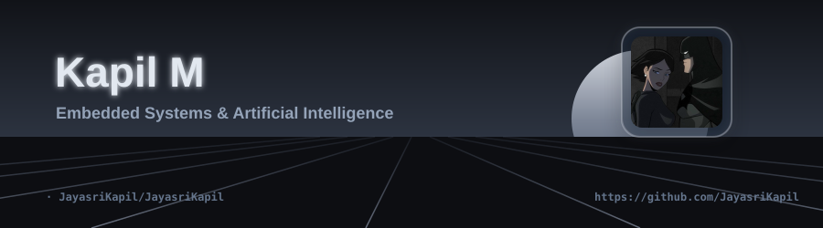
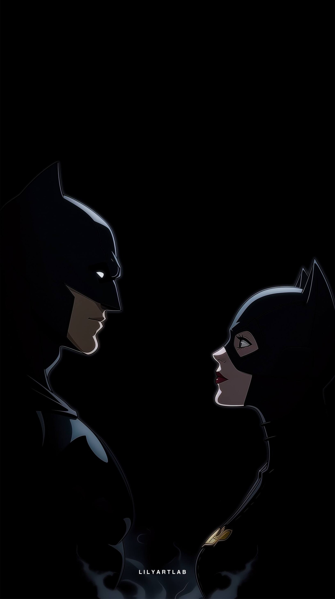

  
  
   
   
  
  <h2>Hey there, I'm Kapil</h2>
  
  
   
   
  
  

    
    
    
  

  <h3>👩‍💻 About Me</h3>

  <table width="100%" style="border-collapse: collapse; border: none;">
    <tr>
      <td width="60%" valign="top" style="padding: 15px 25px;">
        <ul>
          <li>💻 <b>B.E. Electronics & Communication Engineering</b> student passionate about <b>Embedded Systems, Artificial Intelligence, Full-Stack Development, and Software Engineering.</b></li>
          <li>🌱 Currently building intelligent systems that combine hardware and software while continuously expanding my knowledge in AI, Embedded Systems, Automation, and System Design.</li>
          <li>🚀 Developed projects like <b>Railway Smart Ticket Validation System</b>, <b>Campus Communication Network</b>, and <b>Premium GitHub Profile Generator</b>.</li>
          <li>🎯 Goal: Create products that solve real-world problems.</li>
          <li>🌌 Passionate about AI, Embedded Systems, Full Stack Apps, and building things that matter.</li>
          <li>✨ Always chasing the next idea worth building.</li>
        </ul>
        

          <i>"Engineering intelligence where hardware meets software."</i>
        

      </td>
      <td width="40%" align="center" valign="middle" style="padding: 15px 20px;">
        
      </td>
    </tr>
  </table>

 

  <h3>💻 Tech Stack</h3>
  
  

    
  

   
  
  <h3>📈 GitHub Analytics</h3>
  
  

    
  

  
  

    
  

  <h3>🏆 Trophies</h3>
  

    
  

  <h3>🐍 Contribution Graph</h3>
  
  
  
   
   

  <h3>🌐 Let's Connect</h3>
  
  

    
    
    
  

  
  
See you in the next commit 🌸

 

